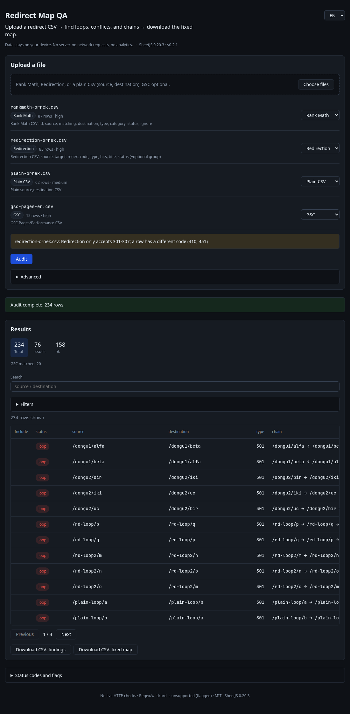
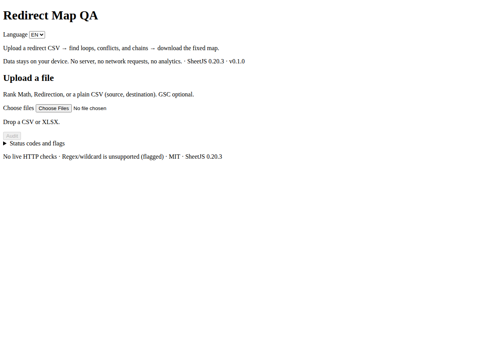
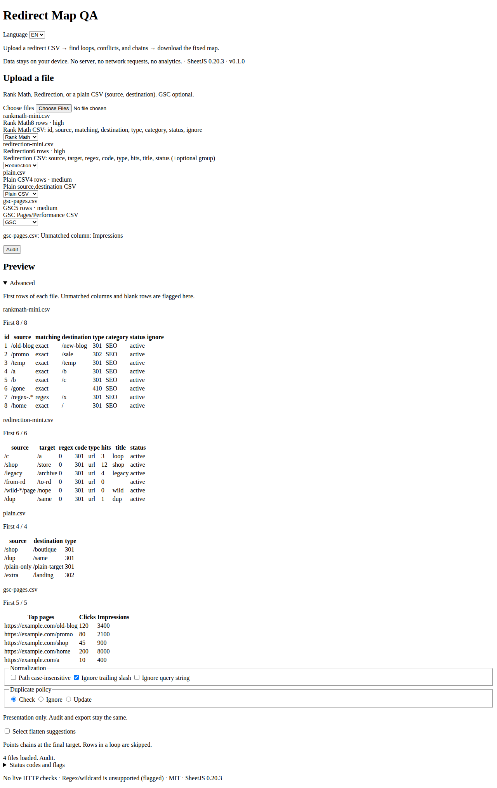
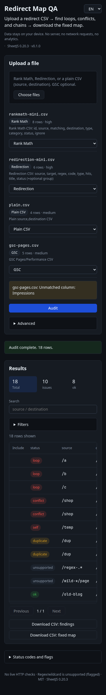

English | [Türkçe](README.tr.md)

# Redirect Map QA

Merge Rank Math, Redirection, and plain `source,destination` CSV/XLSX exports **in the browser**. Find duplicate sources, conflicting destinations, chains, loops, and self-redirects. An optional Google Search Console (GSC) Pages or Performance CSV adds click priority. Download a cleaned map CSV and an issues report.

**[Live demo](https://liarzpl.github.io/redirect-map-qa/)**

**Your data stays on your device.** No server, no OAuth, no analytics, and no live HTTP check or crawl.

License: MIT. Copyright: liarzpl.

Version 0.2.1. The page shows this version from package.json at build time.

The UI has light and dark themes, and a clearer results table.

## Screenshots



Dark theme, audit results.


Light theme, empty upload.



Dark theme, empty upload.



Dark theme, files loaded.



Narrow width, dark audit results.

## Quick start

### Demo

[https://liarzpl.github.io/redirect-map-qa/](https://liarzpl.github.io/redirect-map-qa/)

The demo opens in Turkish when the browser language is Turkish. Otherwise it opens in English. The language menu still switches between TR and EN, and that choice is remembered in this browser.

**Node.js:** `^22.12` (`.nvmrc` is 22.20.0)

From the repository root:

```bash
npm ci
npm test
npm run build
npm run preview
```

Development: `npm run dev`

## Supported inputs

Upload multiple files (CSV / XLSX). The file kind is guessed from the headers, and you can change it. Unknown exports get a column picker (source / destination / type / regex / matching / GSC fields).

### Rank Math Redirects CSV

Source: [How to Create & Edit Redirects Using CSV (Rank Math KB)](https://rankmath.com/kb/how-to-manage-redirects-via-csv/)

Verified columns (headers lowercased, order does not matter):

| Column | Note |
|--------|------|
| `id` | Used when editing |
| `source` | Source URL(s) |
| `matching` | `exact`, `contains`, `start`, `end`, `regex` |
| `destination` | Target |
| `type` | `301`, `302`, `307`, `410`, `451` |
| `category` | Optional |
| `status` | `active` / `inactive` |
| `ignore` | empty or `case` |

If `matching` is one of `regex`, `contains`, `start`, or `end`, the row is **unsupported** and is left out of the audit.

### Redirection (John Godley) CSV

Import format: [Import and export](https://redirection.me/support/import-export/)

Export columns (source `fileio/csv.php`, jsDelivr `johngodley/redirection@5.5.2`):

| Column | Note |
|--------|------|
| `source` | Source |
| `target` | Target (destination in this tool) |
| `regex` | `0` / `1` |
| `code` | HTTP code (`301`...) |
| `type` | `url` / `error` |
| `hits` | Statistics |
| `title` | Title |
| `status` | `active` / `disabled` |

An optional `group` column can appear in newer releases via [PR #4201](https://github.com/johngodley/redirection/pull/4201). It is not required for detection.

The documented import example can also be headerless (`source URL,target URL[,regex,http code,type]`). Headerless files are treated as **unknown**, so the column picker is used.

`regex=1`, or a `*` in the source, is **unsupported**.

### Plain CSV

`source,destination` (or `kaynak`/`hedef`, `from`/`to`). Optional `type`.

### GSC Pages / Performance (optional)

| Role | Recognized headers |
|------|--------------------|
| Page | `Top pages`, `Page`, `Landing page`, `URL`, `En çok ziyaret edilen sayfalar`, `Üst sayfalar`, `Sayfa` |
| Clicks | `Clicks`, `Tıklamalar` |
| Impressions | `Impressions`, `Gösterimler` |

GSC column names vary by product language. If they are not recognized, use the column picker.

### Not fully verified

- Exact export headers on **every** Redirection version (no live-site export sample; checked against the 5.5.2 source and PR #4201).
- Whether Rank Math always writes `matching` on export (the KB import schema is verified, and the KB says export uses the same headers).
- Every language and locale variant of GSC CSV headers.

## Normalization rules

Before comparison:

1. `trim`. The **fragment** (`#...`) is dropped.
2. An absolute URL becomes `host` (lowercase) + `path` (+ query).
3. A relative path gets a leading `/`.
4. **Path** is **case-sensitive** by default. An option makes it insensitive.
5. **Host** is always case-insensitive.
6. A trailing `/` difference is ignored by default (except the root `/`). This can be turned off.
7. **Query** is kept by default. It can be ignored.
8. Percent-encoding is normalized inside path segments.

## Audits

| Flag | Meaning |
|------|---------|
| `duplicate` | Same source and same destination (including across files) |
| `conflict` | Same source, different destination |
| `chain` | A→B and B→C (length ≥ 2 hops). Flatten is suggested |
| `loop` | A cycle (2+). Flatten is **not** suggested |
| `self` | source == destination (after normalization) |
| `unsupported` | Regex / wildcard / contains\|start\|end: left out of the audit |

Each row keeps its source **file name** and **line number**.

**Flatten:** A suggestion that collapses a chain to one hop at the final target. It is not written to the output unless you check the box. Loops get no suggestion.

**GSC join:** `sourceNorm` is matched to `pageNorm`. Sort order: issues first, then higher clicks.

## Output

- A filterable merged table (flag filter, summary counts, pagination)
- `redirect-map-fixed.csv` with `source,destination,type` (checked flatten rows are applied)
- `redirect-map-issues.csv` with the rows that have issues
- Downloads always apply **formula-guard** (`= + - @ |` and fullwidth forms)

## Limits

- **10 MB** per file
- **100,000** rows per file, and 100,000 combined rows
- Heavy auditing runs in a **Web Worker** (`worker-src 'self'`)

## Unsupported

- Live HTTP checks or crawls of destinations
- Resolving regex or wildcard rules
- A WordPress plugin or wp-admin
- A server, OAuth, or analytics

## Security

- SheetJS **0.20.3** from the cdn.sheetjs.com tarball. npm `xlsx@0.18.5` is not used.
- CSP comes from one source, `shared/csp.mjs` (no `unsafe-inline`).
- User data is not inserted with `innerHTML`.
- PWA and saving files on the device (IndexedDB) are off by default. The only thing the app stores is your TR/EN language choice, in this browser's localStorage. File contents and URLs are never stored.
- No `fetch`, XHR, or `sendBeacon`.

## Technology

Vite 6, vanilla TypeScript, and Vitest. Template: `fikir-fabrikasi/sablon/tarayici-arac` @ `cfb3815`.

## Privacy

All processing stays in the browser. Files do not leave the device.
