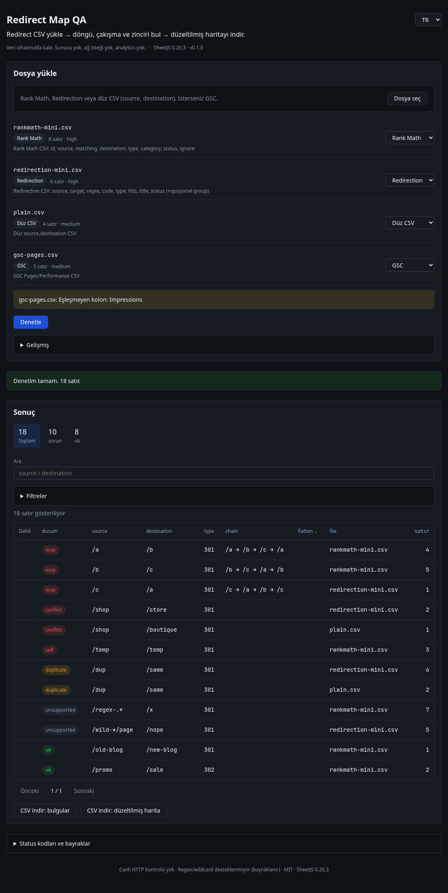
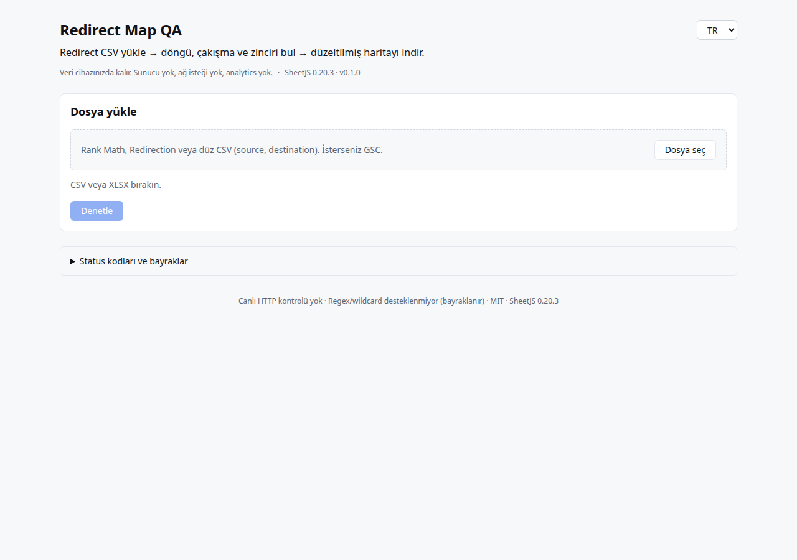
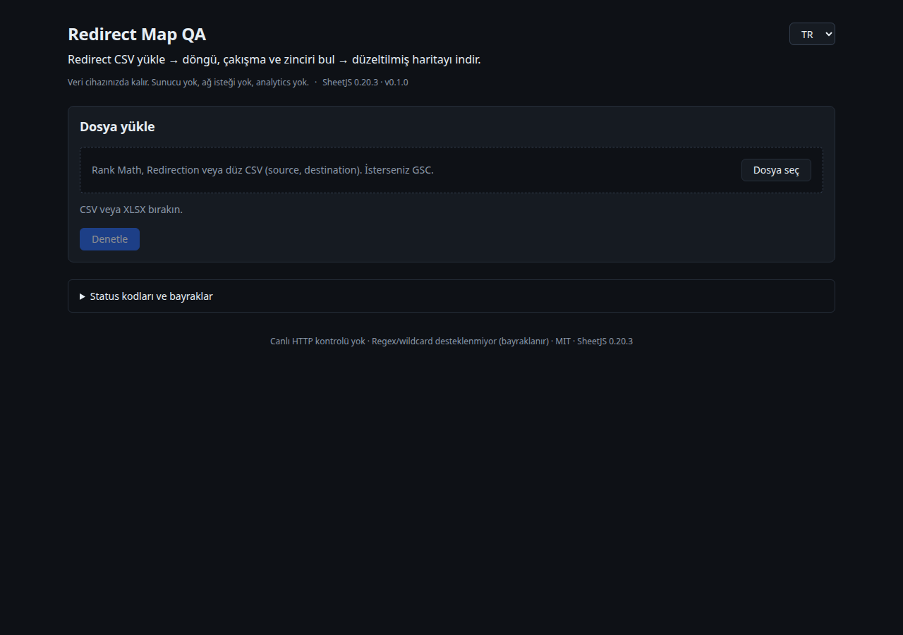
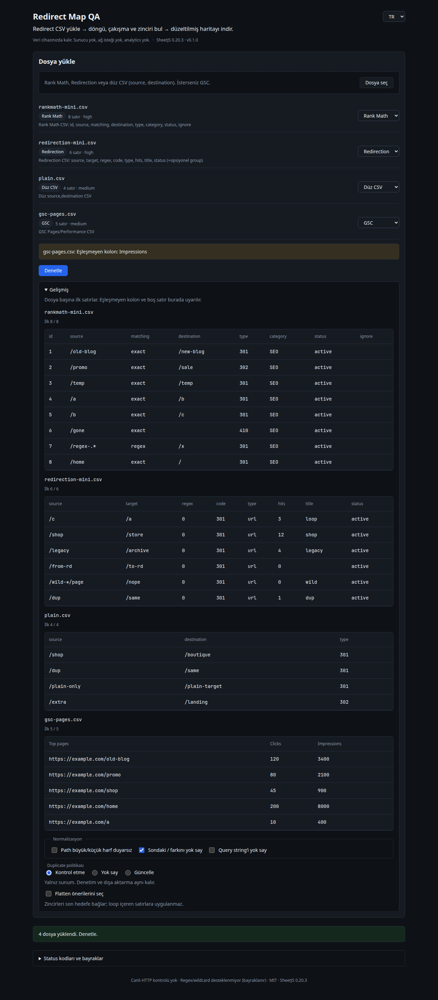
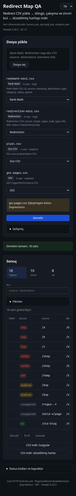

[English](README.md) | Türkçe

# Redirect Map QA

Rank Math, Redirection ve düz `source,destination` CSV/XLSX dışa aktarımlarını **tarayıcıda** birleştirir. Yinelenen kaynak, çakışan hedef, zincir, döngü ve self-redirect bulur. İsteğe bağlı Google Search Console (GSC) Pages veya Performance CSV tıklama önceliği ekler. Düzeltilmiş harita CSV dosyası ve sorun raporu indirilir.

**[Canlı demo](https://liarzpl.github.io/redirect-map-qa/)**

**Veri cihazınızda kalır.** Sunucu yok, OAuth yok, analytics yok, canlı HTTP kontrolü veya crawl yok.

Lisans: MIT. Telif: liarzpl.

Arayüzde açık ve koyu tema ile daha okunaklı bir sonuç tablosu vardır.

## Ekran görüntüleri



Koyu tema, denetim sonuçları.



Açık tema, boş yükleme.



Koyu tema, boş yükleme.



Koyu tema, dosyalar yüklü.



Dar genişlik, koyu tema denetim sonuçları.

## Hızlı başlangıç

### Demo

[https://liarzpl.github.io/redirect-map-qa/](https://liarzpl.github.io/redirect-map-qa/)

Demo Türkçe açılır. İngilizce arayüz için dil menüsünden **EN** seçin.

**Node.js:** `^22.12` (`.nvmrc` = 22.20.0)

Depo kökünden:

```bash
npm ci
npm test
npm run build
npm run preview
```

Geliştirme: `npm run dev`

## Desteklenen girdiler

Çoklu dosya yükleme (CSV / XLSX). Dosya türü başlıklardan tahmin edilir; kullanıcı değiştirebilir. Bilinmeyen export için sütun seçici vardır (source / destination / type / regex / matching / GSC alanları).

### Rank Math Redirects CSV

Kaynak: [Rank Math bilgi bankası: CSV ile yönlendirme](https://rankmath.com/kb/how-to-manage-redirects-via-csv/)

Doğrulanmış sütunlar (başlıklar küçük harf, sırasız):

| Sütun | Not |
|-------|-----|
| `id` | Düzenleme için |
| `source` | Kaynak URL(ler) |
| `matching` | `exact`, `contains`, `start`, `end`, `regex` |
| `destination` | Hedef |
| `type` | `301`, `302`, `307`, `410`, `451` |
| `category` | Opsiyonel |
| `status` | `active` / `inactive` |
| `ignore` | boş veya `case` |

`matching` değeri `regex`, `contains`, `start` veya `end` ise satır **unsupported** sayılır ve denetime girmez.

### Redirection (John Godley) CSV

İçe aktarma biçimi: [Redirection içe ve dışa aktarma](https://redirection.me/support/import-export/)

Export sütunları (kaynak kod `fileio/csv.php`, jsDelivr `johngodley/redirection@5.5.2`):

| Sütun | Not |
|-------|-----|
| `source` | Kaynak |
| `target` | Hedef (bu araçta destination) |
| `regex` | `0` / `1` |
| `code` | HTTP kodu (`301`...) |
| `type` | `url` / `error` |
| `hits` | İstatistik |
| `title` | Başlık |
| `status` | `active` / `disabled` |

Opsiyonel `group` sütunu [PR #4201](https://github.com/johngodley/redirection/pull/4201) ile yeni sürümlerde görülebilir. Tanıma için zorunlu değildir.

Dokümandaki import örneği başlıksız da olabilir (`source URL,target URL[,regex,http code,type]`). Başlıksız dosyalar **bilinmeyen** sayılır ve sütun seçici açılır.

`regex=1` veya kaynakta `*` varsa satır **unsupported** olur.

### Düz CSV

`source,destination` (veya `kaynak`/`hedef`, `from`/`to`). Opsiyonel `type`.

### GSC Pages / Performance (opsiyonel)

| Rol | Tanınan başlıklar |
|-----|-------------------|
| Sayfa | `Top pages`, `Page`, `Landing page`, `URL`, `En çok ziyaret edilen sayfalar`, `Üst sayfalar`, `Sayfa` |
| Tıklama | `Clicks`, `Tıklamalar` |
| Gösterim | `Impressions`, `Gösterimler` |

GSC sütun adları ürün diline göre değişebilir. Tanınmazsa sütun seçiciyi kullanın.

### Doğrulanamayanlar

- Redirection’ın **tüm** sürümlerinde export başlıklarının birebirliği (örnek canlı site export’u yok; 5.5.2 kaynak ve PR #4201 ile doğrulandı).
- Rank Math’in export’ta her zaman `matching` yazıp yazmadığı (KB import şeması doğrulandı; KB, export’un aynı başlıkları ürettiğini belirtiyor).
- GSC CSV’nin tüm dil ve yerel başlık varyantları.

## Normalizasyon kuralları

Karşılaştırmadan önce:

1. `trim`. **Fragment** (`#...`) atılır.
2. Tam URL, `host` (küçük harf) + `path` (+ query) olur.
3. Göreli path’in başına `/` eklenir.
4. **Path** varsayılan olarak **case-sensitive**’tir. Seçenekle duyarsız yapılabilir.
5. **Host** her zaman case-insensitive’dir.
6. Sondaki `/` farkı varsayılan olarak yok sayılır (kök `/` hariç). Bu davranış kapatılabilir.
7. **Query** varsayılan olarak korunur. Yok sayılabilir.
8. Yüzde kodlama, path segment’lerinde normalize edilir.

## Denetimler

| Bayrak | Anlam |
|--------|--------|
| `duplicate` | Aynı source ve aynı destination (dosyalar arası dahil) |
| `conflict` | Aynı source, farklı destination |
| `chain` | A→B ve B→C (uzunluk ≥ 2 hop). Flatten önerilir |
| `loop` | Döngü (2+). Flatten **yok** |
| `self` | source == destination (normalize sonrası) |
| `unsupported` | Regex / wildcard / contains\|start\|end: denetime girmez |

Her satırda kaynak **dosya adı** ve **satır no** korunur.

**Flatten:** Zinciri son hedefe tek hop indiren öneri. Kullanıcı onay kutusunu seçmeden çıktıya yazılmaz. Döngülerde öneri yoktur.

**GSC join:** `sourceNorm` ile `pageNorm` eşlenir. Sıralama: önce sorunlu satırlar, sonra yüksek tıklama.

## Çıktı

- Filtrelenebilir birleşik tablo (bayrak filtresi, özet sayaçlar, sayfalama)
- `redirect-map-fixed.csv`: `source,destination,type` (onaylı flatten uygulanır)
- `redirect-map-issues.csv`: sorunlu satırlar
- İndirmede **formula-guard** zorunlu (`= + - @ |` ve fullwidth biçimler)

## Sınırlar

- Dosya başı **10 MB**
- Dosya başı ve birleşik **100.000** satır
- Ağır denetim **Web Worker** içinde çalışır (`worker-src 'self'`)

## Desteklenmeyenler

- Hedeflere canlı HTTP kontrolü veya crawl
- Regex / wildcard kurallarının çözümü
- WordPress eklentisi veya wp-admin
- Sunucu, OAuth, analytics

## Güvenlik

- SheetJS **0.20.3** (cdn.sheetjs.com tgz). npm `xlsx@0.18.5` kullanılmaz.
- CSP tek kaynak `shared/csp.mjs` (`unsafe-inline` yok).
- Kullanıcı verisi `innerHTML` ile basılmaz.
- PWA ve yerel saklama varsayılan olarak **kapalı**.
- `fetch`, XHR ve `sendBeacon` yok.

## Teknoloji

Vite 6, sade TypeScript ve Vitest. Şablon: `fikir-fabrikasi/sablon/tarayici-arac` @ `cfb3815`.

## Gizlilik

Tüm işlem tarayıcıda yapılır. Dosyalar cihazdan çıkmaz.
